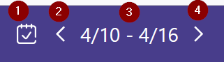
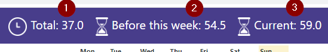
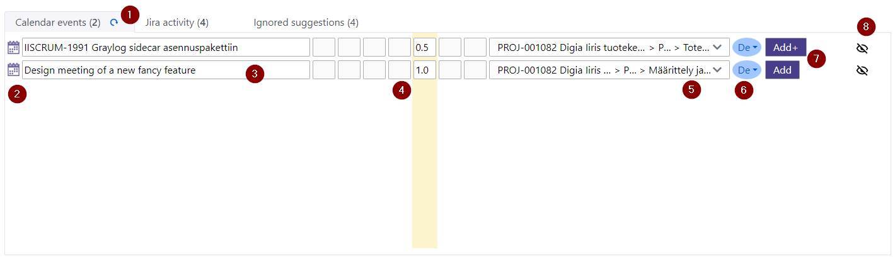
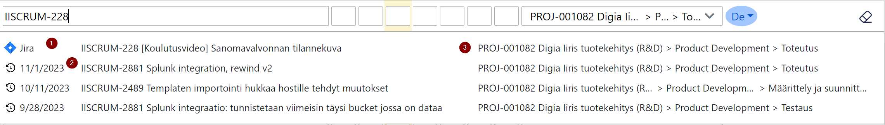
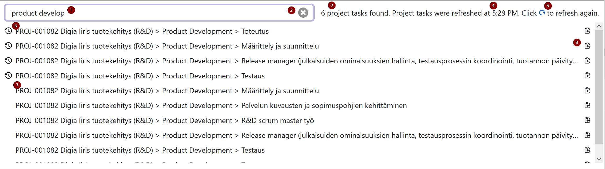
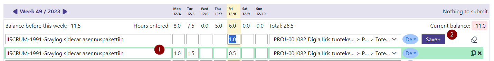
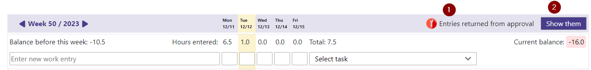
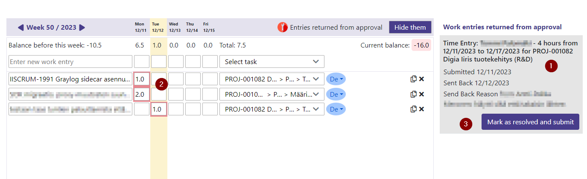

# Table of Contents
{:.no_toc}

* TOC
{:toc}

# Introduction

Soon you will be enjoying the most efficient way of recording work entries into Workday. This application is designed so that you could spend as little time as possible using it!

Work entry recording is **description based**. In other words, you first tell what you have been up to and then the application assists you in choosing the correct project task for recording the work to.

There are multiple ways in which you're helped to record work entries efficiently:

 1. **Events from your Outlook calendar** are provided as suggestions for work entries. If the events contain information about Workday project tasks (see details below) your only job is to accept the suggestions and you're done with them. 
 2. **Recent Workday work entries** are used to auto-fill project tasks for calendar events even if the events themselves do not contain project task information. The most recent work entry with a similar description (event subject) yields the suggested project task.
 3. **Auto-complete** feature and **magic wand** button allow you to select recent work entries as templates for the new work entries. If you have been doing the same things as last week, just click and enter the hours you spent for them today.
 4. A powerful **search engine** makes it easy to find the correct project task using one or more terms (words or parts of words) that occur in the task name.
 5. Work entries are **saved in the background** while you can continue entering new ones. No need to wait for anything.
 6. The work entries are **submitted automatically** (if you don't change the setting to manual) so that you don't need to try remembering it.
 7. You can **easily see and modify** all the entries you have recorded for the week.
 8. The **hour balance** before the week is shown alongside with week's total hours and the resulting current balance.
 9. The work entries that have been **returned from approval** are indicated clearly, preventing you from accidentally re-submitting the week without first taking action based on the feedback from the approval process.

There are some things that you cannot do with this application. So, in order to record the following entries you must go to Workday:
 1. Vacations and other absences
 2. Work entries titled to separately approved compensation
 3. Overtime work entries

# Glossary of Important Terms

| Term | Its meaning in this context  |
|--|--|
| **Work description** | In the description field, you type in what you've been doing. This will be printed in the invoice sent to the customer, alongside with the project task. Often this is the same as a ticket number (eg. in Jira) or a calendar event subject. |
| **Work entry** | Work you have done for a week, including the work description, work hours for each weekday, project task selection, and possibly role selection. |
| **Hours** | Number of hours you've been working on a thing. The hours can be entered in 0.5 hours (30 minutes) precision. |
| **Project task** | Project task uniquely identifies the project, phase, and task that a work is targeted to. The project task will determine cost center, billing rate, etc. Project task is represented as `Project > Phase > Task`. |
| **Role** | Projects may have multiple roles with different billing rates. Usually roles are not shown because the user is assigned to a single role in the project. |
| **Suggestion** | Suggested work entry based on Outlook calendar events. Users can modify suggestions and apply them, converting them to normal work entries. |

# Installation and Configuration

## Requirements

This application is used with a web browser. The application must be configured every time you start it on a new computer (or in incognito window). That is because the application stores user-specific data only in the storage of your browser. No data is stored on Tuntilukkari cloud services.

Currently, only Edge, Chrome, Chromium and Firefox browsers are supported.

## Authentication

You will be prompted to authenticate using corporate credentials. Authentication allows the application to access your calendar and make work entry suggestions based on the week's events.

1. Click the login button to be redirected to Microsoft authentication used by your company.

## Setup Process

The user interface guides you through the initial setup process.

During the setup process, you will be instructed to activate a browser extension. The browser extension enables RPA (Robotic Process Automation)
techonology which performs operations in Workday user interface in an automated and efficient fashion on your behalf.

## Workday Window

Workday must be opened on another window/tab of the browser. Actually, it is enough to just briefly open Workday and then close it. That enables Tuntilukkari to use Workday's user session to access Workday APIs.

The application will prompt you if the Workday session is going to expire and you need to open Workday again on another window.

To automate Workday window opening, please allow popups for the page in the browser.

# Module Selection and General Usage

The application consists of different modules. The current module can be switched from the menu in the top-left corner.

 1. **Enter Hours** module allows you to record work entries, see its manual [below](#enter-hours-usage-and-features)
 2. **View My Hours** module allows you to search and visualize work entries of the past, see its manual [below](#view-my-hours-usage-and-features)
 3. **Documentation** opens this user manual
 4. **Support channel** opens the Teams support channel

## Number of Workday Notifications

In the top-right corner of the page, the number of unacknowledged Workday notifications and actions waiting for you in Workday inbox are shown. You can click the icons to open Workday notifications or inbox on another browser tab.

## User Menu

User menu can be accessed from the profile picture in the top-right corner of the page.

 1. Access user settings, see [below](#user-settings)
 2. Log out

## User Settings

User settings can be accessed from the profile picture in the top-right corner of the page -> `Settings`.

| Setting | Description |
| ------- | ----------- |
| Submit work entries automatically | When selected, the work entries entered by the user are automatically submitted for approval after saving. Note that you can still modify the work entries even if they have been submitted. When unselected, the user must submit the work entries manually using `Submit` button (see [below](#submitting-work-entries-for-approval)). |
| Save changes to work entries automatically | When selected, changes to the work entries are automatically saved. When unselected, the user must save the changes manually using `Save` button (see [below](#saving-changes-manually)). |
| Fetch also private calendar events | When selected, calendar events marked as private are also fetched and offered as suggestions for work entries of the day |
| Select the current weekday by default | When selected, the current weekday is selected at application startup. When unselected, the hours of the entire week are shown. |
| Hours input tick interval | Set the interval that is used in hour input control when using up or down buttons or keyboard arrows to increase or decrease the hours. |
| Default role for new entries | The selected role is used as default for new work entries. If a project does not have the default role then the first available role is selected. |

# Enter Hours: Usage and Features

## Week Selection

In the top bar, the currently selected week is indicated and can be changed:

 1. You can navigate to the current week by clicking the icon.
 2. Switch to the previous week.
 3. The currently selected week (starting from Monday) is shown.
 4. Switch to the next week.
 
Changing a week causes the page to reload and synchronize data again from Workday.

## Hour Balances

In the top bar, three numbers are indicated concerning the hour balances:

 1. Total number of hours entered so far for the week. This includes entries that are just being saved into Workday. Suggestions are not included.
 2. Hour balance before the week, corresponding to the balance shown by `Time Off Balance` Wokday report
 3. Current hour balance considering hour balance before the week, the required work hours and the total number of hours entered so far. The current balance considers only such weekdays that have work entries recorded for them.

## Weekday Selection

Only such suggestions and week's entries are shown which have hours on the selected weekday.

1. Selected weekday can be changed by clicking the weekday caption. Clicking the currently selected weekday shows the hours of the entire week.
2. You can show Saturnday and Sunday by clicking `Show weekend`.

By default, the current weekday is selected. You can change the behavior so that the entire week is shown by default. See settings [below](#user-settings).

## Suggestions

The application automatically makes suggestions of week's work entries based on Outlook calendar events.

Suggestions can also be ignored. Ignored suggestions are shown in a separate collapsible list. If you ignore a calendar event series the event occurrences will show up as ignored suggestions also in the future.

1. You can apply apply all the complete and autofilled suggestions by clicking `Apply all` button.
2. Icon shows the source of the suggestion. Clicking the icon shows calendar event details.
3. The suggested work description is either the event subject or parsed from the event text (see [below](#calendar-event-notations-to-enable-automatic-suggestions)).
4. The suggested hours are taken from the event durations.
5. The suggested project task is based on the event text (see [below](#calendar-event-notations-to-enable-automatic-suggestions)). If the event does not specify the project task, the application suggests project task using the recent work entry history, searching for a work description that matches the event subject.
6. You can select the role from a dropdown in case you have multiple roles assigned in the project. By default, the first role or the default role set in [user settings](#user-settings) is selected.
7. Possible warnings are indicated with an icon with a tooltip describing the warning in more detail.
 > The application warns if project task matching accuracy was low, ie. if the project task specified in the event does not match with available project tasks with high accuracy.

> Also, the application warns if the project task parsed from the event does not match the project task used the last time in recent work entry history with a similar work description.
8. Suggestions can be ignored meaning that they will disppear from suggestions list. Ignoring calendar event series will cause the future event occurences be ignored automatically.
9. Suggestion state can be one of the following:
	- `Incomplete` not all the fields are filled up
	- `Complete` there are user-made changes and the suggestion can be applied
	- `Autofilled` automatic suggestion can be applied as such
10. You can apply the suggestion by clicking `Apply` button. The applied entry moves to week's work entries where you can still modify it.
11. You can review the ignored suggestions by clicking `Ignored suggestions` list. Ignored suggestions can be restored back to suggestions or applied as work entries.

Note that you don't need to apply all the suggestions. Usually, there are such events in your calendar that are irrelevant to the work entry recording. You can either ignore those irrelevant events by clicking ignore icon or just leave them be.

BTW, private calendar events are automatically filtered out from the suggestions.

> Pro tip: Ignore such calendar event series that are not recorded as work entries; such as time spent on daily scrum meetings that will be recorded to the actual tasks at hand.

## Entering New Work Entry

With this functionality, you can enter new work entries manually if the suggestions (see above) do not cover all the week's activities.

1. Magic wand button opens a dialog where you can select recent activity as a tempate for the new work entry (see [below](#magic-wand-dialog-using-recent-activity-as-template) for more details).
2. You can type in the description if you don't use the magic wand button to fill it.
> Note that you can enter long and multiline text into the description field. After entering a long text, the text input will collapse and you will be indicated by an ellipsis (…) that some part of the text is not visible.
3. Number of hours you've been working on the subject for each weekday. The hours can be entered in 0.5 hours (30 minutes) precision.
4. You can select the project task from a dropdown (see [below](#project-task-selection) for more details) if you don't use the magic wand button to fill it.
5. You can select the role from a dropdown in case you have multiple roles assigned in the project. By default, the first role or the default role set in [user settings](#user-settings) is selected.
6. You can reset new work entry fields to empty values
7. State can be one of the following:
	- `Incomplete` not all the fields are filled up
	- `Complete` entry is ready to be saved
8. You can save the new work entry by clicking `Save` button. The entry moves to the week's work entries where you can still modify it. 

> Pro tip: You can use `Tab` and `Shift+Tab` to move between fields quickly.

> Pro tip 2: You can start typing (ie. searching) project task name immediately after moving focus to the dropdown button with `Tab`. You can also press `Space` to open the task list.

One word of caution: If you usually find yourself typing in the description, hours, and project task selection manually you should probably adopt other features such as magic wand button or auto-completion. Also, you could try to change your whole way of organizing the time at work (see further thoughts about it [below](#tips-for-managing-your-time-entries-at-work)).

## Work Description Field Auto-Complete

Work description field offers auto-complete suggestions based on the recent work entry history. Picking up an auto-complete suggestion also selects the project task that has been recently used for that work description.

1. Click an auto-complete suggestion to go with that description. Hovering a mouse over an auto-complete suggestions shows the project task what will be selected when the suggestions is clicked.

> Pro tip: You can use 'Arrow Down' key to move from description field to the auto-complete list.

## Magic Wand Dialog (Using Recent Activity as Template)

The dialog shows recent activity that can be selected as a template for the new work entry.

 1. You can search recent activity using one or more terms (words or parts of words) that occur in the recent activity. For example, "Design act" matches "PROJ-123 **Design** a new way for users to inter**act** with calibration management".
 2. Work entries for the last 10 weeks are shown here. The list shows their work descriptions. A tooltip for each entry shows the latest entry date and the project task used. Selecting a recent work entry preselects work description and project tasks fields, allowing you to type in the hours.

> Pro tip: Pressing `Enter` in hours field after selecting the template and entering hours saves the new entry.

## Project Task Selection

Project task is selected from a dropdown that shows all the available project tasks.

 1. The project task name parsed from the calendar event (if such was found) is shown at the top of the list in a gray color as a hint for selecting the correct task.
 2. You can search project tasks using one or more terms (words or parts of words) that occur in the recent activity. For example, "Design act" matches "PROJ-123 **Design** a new way for users to inter**act** with calibration management".
 3. Project task is selected from the dropdown list.
 4. Project task name can be copied to clipboard.

> Pro tip: You can move from the search field to the list by hitting `Tab`. Then, you can use arrow keys to navigate and `Enter` to select the item in the list.

> Pro tip 2: Pressing `Enter` in project task dropdown after selecting the task saves the new entry.

## The Week's Work Entries

The work entries that are so far entered for the week are shown in a table.

 1. You can change the work description.
 2. Long description texts are indicated with an ellipsis (…)
 3. You can change the hours for each weekday.
 4. You can change the project task selection.
 5. You can change the role for such projects where you have been assigned to more than one role. The selected role is shown with its initial letters.
 6. You can duplicate the work entry to enter another one. Duplicating copies the hours and project task of the original one to the new entry, leaving for you to write the work description.
 7. You can delete the work entry.
 8. The work entry state can be one of the following:
	- `Draft` not all the fields are filled up
	- `Saving` the fields have changed and saving is in progress
	- `Deleting` the used has deleted the entry and deletion is in progress
	- `Saved` all the changes have been saved successfully
	- `Error` there was an error saving or deleting the entry; the error text is shown in detail and you can try saving the entry again by modifying some of the fields

The changes you make to week's entries are saved either automatically or manually depending on the user setting (see [above](#user-settings)). Once the saving has started, it proceeds in the background.
You can freely continue making modifications to work entries even though there are savings in progress. The application makes sure that all the modifications are taken into account.

### Saving Changes Manually

These buttons appear only if you have opted for saving changes to work entries manually in user settings (see [above](#user-settings)).

 9. You can save the changes to the work entry in question.
 10. You can discard the changes, restoring the work entry fields to their previously saved values.

## Adding Hours to an Existing Work Entry

When recording new hours to a work entry that already exists on the current week, the hours will be added to the current entry.

 1. The existing entry with an identical description and project task is indicated with a green background when the new entry is being edited.
 2. Save button has `+` indicating that the hours will be added to an existing item instead of creating a new one.

> Pro tip: You can add hours to existing entries in multiple ways. Either editing the hours in the week's work entries, adding a new one with identical description and project task, using auto-complete or magic wand button to choose an existing entry, or applying a suggestion that is similar to an existing entry. Take whichever you like best

## Submitting Work Entries for Approval

The saved work entries can be submitted either automatically or manually (see setting [above](#user-settings)).

1. Submit status can be one of the following:
   - `Entries can be submitted` the saved work entries need to be submitted manually
   - `Submitting` the work entries are being submitted (either automatically or because the user has submitted them)
   - `Submitting after other operations have completed` the user has changed work entries and their saving is in progress; submit will happen after saving has finished
   - `All entries have been submitted` today's work entries have been submitted for approval
   - `Unsubmitted entries from this week` when opening up the application there have been unsubmitted work entries; you can submit them manually
2. You can submit all the work entries. Note that this submits hours of all the weekdays of the week regardless of the weekday selection.

## Work Entries Returned from Approval

Hours cannot be submitted if there are work entries that have been returned from approval by the project manager.

1. The situation is indicated by an icon and a text
2. Clicking `Show them` opens up a sidebar that shows the returned work entries and the feedback from approval

There can be multiple returns from approval.

1. Feedback can be selected by clicking it
2. The work entries related to the returned submit are highlighted with a red frame in the week's work entries. Note that Workday does not allow focusing the feedback on specific hours. Instead, all the hours submitted at the same time are highlighted and the feedback helps you to decided what corrections need to be done to the entries.
3. Feedback shows all the major events of the approval process, including the submitting of the work entries and their sending back, along with a comment from the project manager.
4. Feedback status can be `Unresolved` or `Resolved`.
5. Once you have made the corrections to the returned work entries, mark the feedback as resolved. Only then you can submit the work entries of the week.

Note that you need to submit the week's work entries to resolve the approval feedback completely. Otherwise, the feedback show up again when you reload the application.

## Calendar Event Notations to Enable Automatic Suggestions

The application searches the calendar event text (body description) for the following supported notations that may be used to mark the targeted project task for the event. Also the description text can be given in the event text if the event subject is not appropriate for work entries.

|Example|Notes|
|--|--|
|Workday: \<project task>|The separator (color) is optional. Instead of colon, there can also be semicolon (;), equation sign (=) or even line break before the project task |
|Workday: "\<project task>"| You can surround the project task with single or double quotation marks|
|WD: \<project task>|Other keywords also supported: Tuntikirjauskohde, Tuntikohde, Hours, Hours to, Task, Tunnit|
|Workday: \<project task>, description: \<work description>|The work description can be given after the project task. Work description field must be seperated from the project task with a separator such as comma, dot (.) or a line break.|
|Workday: \<project task>, comments: \<work description>|Other keywords also supported for work description field: Kommentiksi, Kommentti, Jira ticket, Jira, Comment, Selite, Selitteeksi, Tiketille, Tiketti|

# View My Hours: Usage and Features

## Entry Filtering

The left-hand side of the page allows you to filter the work entries inspected.

1. Filter work entries according to dates.
2. Filter work entries according to work descriptions.
3. Filter work entries according to projects.
4. Filter work entries according to project tasks.
5. A filter can be expanded and modified by clicking the arrow button.
6. An active filter is indicated with an icon. The filter can be cleared by clicking the button.

## Fetching More History

Initially, only two weeks of history is fetched.

Changing the date filtering causes the application to start fetching entry history data from a longer period of time.

## Histogram

The filtered work entries are visualized with a histogram panel:

1. The hours are showed as a graph, showing each day and its total hours separately.
2. The title shows the total number of hours, minimum and maximum number of daily hours, and the average number of daily hours.
3. The work entries selected in the table below are indicated with a dark blue color.
4. You can zoom in by dragging the mouse over a date period. This changes the date filtering.

## Table

The filtered work entries are visualized with a table, using four different visualization styles:

1. Show hours per work description and project task.
2. Show hours per project.
3. Show hours per project task.
4. Show all recorded work entries.
5. Rows can be selected. The selected rows are indicated in the [histogram](#histogram) panel with dark blue color.
6. The selected rows can be added to filtering. This moves the table visualization to a more detailed level (from example, from projects to tasks).
7. The total number of selected rows and their hours is shown.
8. The filtered work entries with all the four table visualization styles can be exported into an Excel file. The excel workbook contains four worksheets, one for each table visualization style.

# Privacy Policy

## Data Accessed and Stored

Tuntilukkari is integrated with Workday and Outlook 365 services so that it can access the following data:
- Outlook 365 calendar events
- Workday work entries
- Basic information of Workday project tasks that are available to the user
- User's time-off balance in Workday
- Number of Workday notifications and actions waiting in the user's inbox

Tuntilukkari does not store any of the above data on its cloud services. However, the following data is stored by Tuntilukkari on the **local storage of the user's browser**:
- User settings
- Recent work entries cache
- Available project tasks cache

The above data stored on the browser's local storage does not contain any personal data of the user. Note that the cache data is encrypted so that it is safe to use Tuntilukkari on shared or home computers even if task names or work entries contained confidential corporate information.

## Data Protection Rights

All the data stored by Tuntilukkari reside on the computer used by the user and more specifically on the local storage of the browser. Thus, users can manage the data (which does not contain any personal user information) by themselves.

Users can access and manage all data stored by Tuntilukkari with the help of browser's tools. With Chrome: three dot menu -> More tools -> Developer tools -> Application -> Local Storage.

## Cookies

The cookies managed by Tuntilukkari do not contain any personal data. Tuntilukkari does not use cookies to track users in any way.

## Contact Details

You can find the contact details of Tuntilukkari support on the footer section of Tuntilukkari user interface.

# What to Do if the Application Does Not Work (aka Emergency & Contingency Policy)

1. Don't panic - you can always switch to use Workday to record work entries
2. If the problem persists, please contact support. You can find the contact details of Tuntilukkari support on the footer section of Tuntilukkari user interface.

# Tips for Managing your Time Entries at Work

## Mark Project Tasks to Calendar Meeting Invitations

It not unusual to hear complaints after Teams or face-to-face meetings concerning the supposed way of reporting the consumed work hours. `Where I am supposed to record that meeting to in Workday?`

> Tip: Launch the practice of marking the supposed work entry information in every meeting invitation you send. Soon others will follow, noting by themselves how advantageous it is. Everyone attended will be able to record their work hours in a similar way, not needing to ponder by themselves over the proper project task target.

Project tasks marked at calendar events also enable Tuntilukkari to make automatic suggestions concerning the time used for events. 

## Use the Slightest Opportunities to Record Tasks unto

The work day may sometime se quite hectic or even filled with total chaos. At the completion of the day, it may be difficult to sort out what you have been doing, and above all, unto which work entries would you divide your day into.

> Tip: Use the slightest opportunities of obvious tasks to record hours to them. Even if you spent 5 minutes on a telephone — if you got a straightforward project task to record it into, use it! You've got 25 minutes extra to engage in other, not so clearly expressable matters of work.

## Use Outlook Calendar Excessively during the Day to Keep Track of your Doings

This tip suits only for calendar oriented people whose days are filled with meetings, accompanied with sporadic times of "real work".

> Tip: During the day, mark every thing you've been doing to your Outlook calendar as tentative meetings. Let us say you finished with a meeting and had 30 minutes to do some "real work" before the next one. To keep track of your doings, mark that half an hour in your calendar as an event, writing down what you've been doing. At the end of the day, you can use Tuntilukkari to record these events into Workday.

## Include Context Switching in the Work Entries

It takes normal people 23 minutes to orientate yourself when switching from one kind of work to another ([source](https://www.loom.com/blog/cost-of-context-switching)). When your day is full with context switches it is often frustrating to add up the working hours at the end of the day.
> Tip: Even though it may feel like you were not accomplishing much, do not fool yourself into writing down less hours than you have been spending.

> Tip: Times of context switching should be assigned to the tasks at hand. For example, it is a good practice to record 1,5 hours for a one-hour meeting if it meant you had to orientate yourself either before or after the meeting.

# Development Roadmap

## v7.x

- Retrieve project tasks from Workday REST API instead of RPA to get the application to work for users with hundreds of projects
- User can undo some changes (eg. work entry deletion)
- Compatibility improvements for different Workday language etc. settings
- Bug fix: If the user is fixed to a role on task level assignment the saving of work entries may fail

## v8

Jira integration:
- The user can configure unlimited Jira instances to integrate with
- Magic wand dialog shows recent Jira tickets based on Jira activity (eg. the user has commented on a ticket)
- Jira time tracking: time tracking marked in Jira tickets is shown up as a suggestion
- Jira time tracking: work entry hours are recorded as time tracking in Jira tickets
- Project task is taken from Jira ticket or its epic link

## v9

Internal comments:
- Work entries have internal comment fields that are shown only to project manager at approval and not printed in the customer invoice

Clockify styled work log and clocking for the day.

# Change History

## v7.0

- Enter Hours: User can change the selected week for which to record work entries
- Work entries returned from approval are updated periodically in the background

## v6.266
- Bug fix: With Firefox copy button for task name was hidden behind a vertical scrollbar
- Bug fix: Inbox should not be refreshed when Workday session has been timed out; caused a lot of 4xx & 5xx responses

## v6.261
- View My Hours module no longer WIP (Work In Progress)
- View My Hours: User can choose between different table modes that show the data by description, by project, by task, or each entry separately
- View My Hours: Selected table rows are highlighted in the histograph graph bars
- View My Hours: Various bug fixes, usability issues, and visual improvements
- View My Hours: User can easily reset filters
- View My Hours: User can select a date range by dragging/zooming the histogram graph
- View My Hours: User can export hour table data to Excel
- Bug fix: Merging two saved entries and saving it resulted in 500 Internal Server Error
- Bug fix: Dashes in task name messed up the automatic suggestion based on a calendar event
- Bug fix: Suggestion pagination was updated with a long delay at page load

## v6.177
- Bug fix: Sometimes saving ended with 409 EXISTING_HOURS_DO_NOT_MATCH
- Bug fix: When changing hours just after applying a suggestion the change was not saved automatically
- Bug fix: Changing hours with up/down keys did not save the changes
- New user setting: Hour input tick interval
- Improved error handling of RPA functions in order to avoid various errors in initialization and entry saving
- Support for EXT users who do not have Time Off Balance reportt
- View My Hours fetches entry history separately from Enter Hours screen so that the entry history is certainly correct

## v6.116
 - Provide user specific instructions on how to solve the situation where saving fails because of project changes that prevent the use of Enter Time by Type dialog of Workday

## v6.115
 - Bug fix: Current balance did not include Overtime as fee and other non-regular absence plans
 - Bug fix: Saving sometimes failed with a cryptic ReferenceError error
 - Added link from the current balance to open Time Off Report in Workday window

## v6.107
- When work entries were modified in Workday while the application was open it could results in duplicate entries if the user modified the same entries in the app afterwards

## v6.99
- Suggestions take a maximum of 1/3 of screen height and use pagination
- User can switch the selected weekday by clicking the total hours of a weekday
- Don't user monospace font for description input field because it didn't look nice
- Bug fix: Getting week's entries left recovered sessions to Workday (regression bug from v6.62)

## v6.62
- Support for Workday instances with different default locales
- Support for Workday instances which do not use project roles
- Preview mode for potential customers with no Azure integration
- Bug fix: Saving of week's entries sometimes worked incorrectly if there were more than 30 entries for the week

## v6.0
- Support for Firefox
- Hours can be entered with two decimals
- View My Hours module (first experimental version)
- Added a menu to switch between modules; documentation and support channel links moved to the menu as well
- Optimized project synchronization to tackle with "Too many repeating requests" error
- Role options are synchronized lazily only after projects have been saved to optimize data synchronization
- New (probably just a temporary) logo

## v5.270
- User can select a default role for new work entries in the user settings
- Role options are shown for new entries already before the entry has been saved
- Project specific role options are cached to speeden up data synchronization
- Bug fix: Apply+ sometimes did not add hours to the existing (and highlighted) row
- Bug fix: Recent entry query returned invalid dates for the entries of the last year
- Header has now link to Teams support channel

## v5.240
- New domain name
- Bug fix: Hour balance was calculated incorrectly when adding hours to vacation days
- Bug fix: Autocomplete fuzzy search had broken in recent changes
- Filter away Holiday and like events from calendar events
- Initialization view hints about allowing popups if they are blocked

## v5.235
- Version updates are indicated to all active users
- Application can be open for the whole week, no need to refresh page when day changes
- Workday session is updated semi-automatically (especially if popups are enabled for the page)
- Bug fix: Some users experienced "RangeError: Maximum call stack size exceeded" error in initialization view
- Bug fix: Some users experiences 502 errors when saving work entries; especially if the window had been open for a long period of time
- Bug fix: Some users had 401 errors in initialization after computer had been awoken from sleep
- Bug fix: Some users experienced "Too many concurrent requests" errors while saving work entries
- UI color improvements
- Use parsed task name in task selection dropdown as the initial search input instead of showing it in grey colored text
- Apply button is yellow (with icon) if there are warnings related to suggestion task auto-selection

## v5.137

- Bug fix: Modifying hours of an existing entry without role options sometimes resulted in duplicate hours (visible only after page refresh)
- Cosmetic UI fixes related to showing saving errors and a warning next to task button

## v5.126

- Bug fix: Recording work entries caused 0-hour rows to appear for approving; also Ready to Bill status was removed for existing hours
- Handle "Too many repeating requests" error by Workday
- Bug fix: Application caused left-over recovered sessions in Workday
- Bug fix: When modifying multiple saved entries with similar descriptions and task names the hours were sometimes messed up
- Some cosmetic bug fixes related to displayment of warnings and errors

## v5.116

- User setting on whether to fetch private calendar events or not
- User settings on whether the current weekdady is selected by default or whether the entire week is shown
- Apply all button is shown also when a weekday is selected
- Shown a hint of the entire week view when a weekday is selected so that hours from other weekdays are hiddn
- Suggestions are not shown for future days in entire week view
- Improvements on responsiveness on large screen
- Preserve the order of the week's work entries when the application is restarted
- Azure authentication is refreshed silently in the background
- A new extension (v4.2) which removes the need to restart browser at installation phase

## v5

- Record calendar week hours instead of the current day
- Work entries returned from approval are indicated clearly along with their feedback
- Week view can be filtered to show hours from one weekday at a time
- When entering a work entry that's already present in the current week, indicate it and add the hours to the existing entry
- Billed, overtime and compensated work entries are shown as non-editable entry rows
- Auto-complete list can be navigated with arrow up & down keys
- Bug fix: Recent entry fetching left gaps in the history so that some recent entries could not be used as templates for new entries
- Bug fix: User could not type hours exceeding 9.9
- Bug fix: Saving of work entries sometimes resulted in 502 errors

## v4

- User option to save changes manually instead of applying them automatically
- Encrypt cache data on browser's local storage to protect corporate data on shared or home computers
- Full support for Chromium browser
- Better interoperability with the browser extension
- Suggestions pane incidates which calendar entries overlap each other
- The user can view calendar event details by clicking the calendar icon
- Bug fix: Retrying failed saving created a duplicate work entry
- Auto-complete of work entry description based on history
- UI responsiveness improvements
- Show also non-exact search results in task selection dropdown
- Check that Workday UI language setting is supported by RPA integration
- Improvements to task name parsing from a calendar entry
- Hint the user at the first auto-submit that there is a setting to change the behavior
- Enter can be used as a keyboard shortcut to save and apply

## v3

- Role selection if the user is assigned to multiple roles in a project
- Improved responsiveness of the main table view
- Project task names can be copied to clipboard
- Show full project task name on mouse hover it the name has been cut with ellipsis on small screens
- Show a warning if the task selection differs from a recent work entry with similar description
- Page load performance improvements
- Initialization is shown on a separate view instead of using alerts to indicate initialization
- Use local storage cache to improve data synchronization performance
- New entry must be saved manually; no more auto-saving of new entries because it was not so usable after all
- Lots of minor usability improvements and some minor bug fixes
- Chrome and Edge extensions published and installable in web stores
- Hour input field accepts comma as decimal separator

