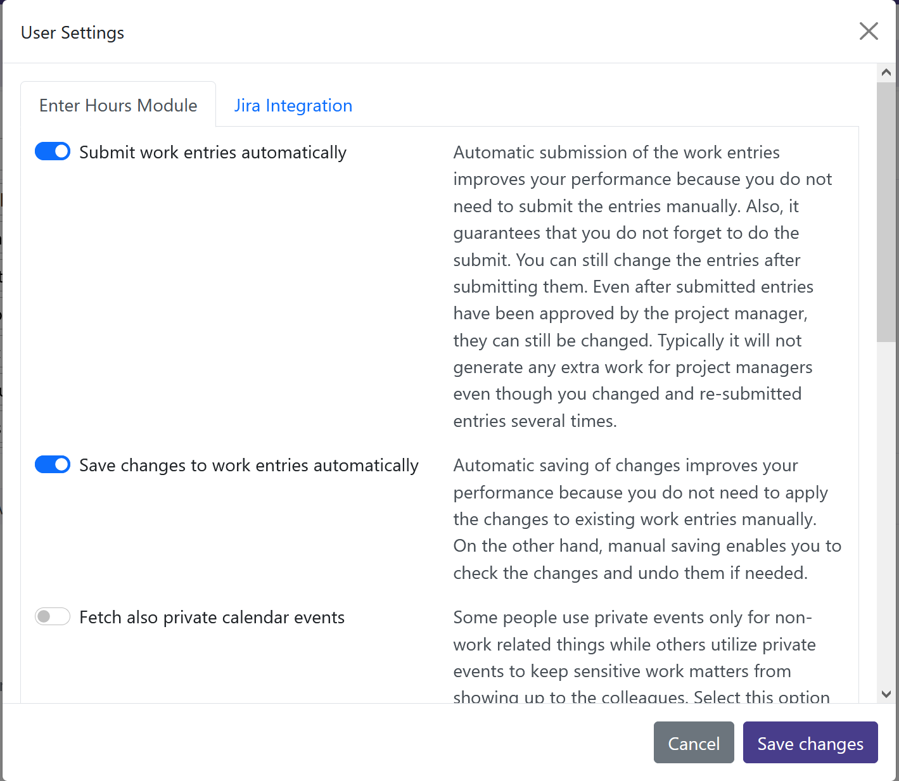
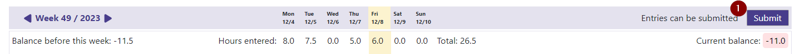
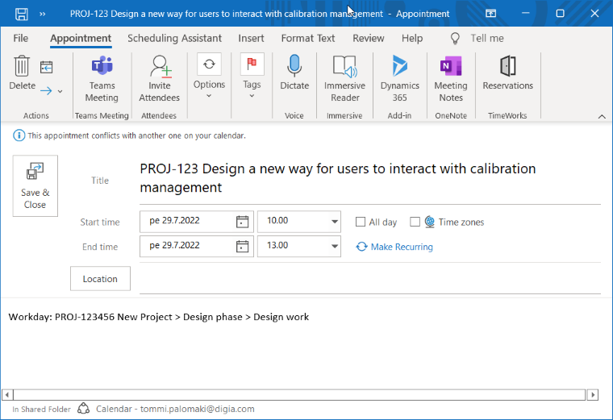

# Table of Contents
{:.no_toc}

* TOC
{:toc}

# Introduction

Soon you will be enjoying the most efficient way of recording day's work entries into Workday. This tool is designed so that you could spend as little time as possible using it!

On purpose, work entries can be entered only for today. It is meant that you will record work entries at the end of every day — although you can see your entries straight also throughout the whole day.

Work entry recording is **description based**. In other words, you first tell what you have been up to and then the tool assists in choosing the correct project task to record the work to.

There are multiple ways in which you're helped to record day's work efficiently:

 1. Events from your Outlook calendar are provided as suggestions for work entries. If the events contain information about Workday project tasks (see details below) your only job is to accept the suggestions and you're done with them. 
 2. Recent Workday work entries are used to auto-fill project tasks for calendar events even if the events themselves do not contain project task information. The most recent work entry with a similar description (event subject) yields the suggested project task.
 3. Magic wand button allows you to select recent work entries as templates for the new work entries. If you have been doing the same things as yesterday, just click and enter the hours you spent for them today.
 4. A powerful search engine makes it easy to find the correct project task using one or more terms (words or parts of words) that occur in the task name.
 5. Work entries are saved in the background while you can continue entering new ones. No need to wait for anything.
 6. You don't need to fear forgetting to submit the work entries because it's taken care of automatically.
 7. You can easily see all the entries you have recorded for today and modify them if need be.
 8. The hour balance before today is shown alongside with today's total hours and the resulting current balance.

# Glossary of Important Terms

| Term | Its meaning in this context  |
|--|--|
| **Work description** | In the description field, you type in what you've been doing. This will be printed in the invoice sent to the customer, alongside with the project task. Often this is the same as a ticket number (eg. in Jira) or a calendar event subject (in which case you won't enter it manually here but you suggestions further below). |
| **Hours** | Number of hours you've been working on a subject. The hours can be entered in 0.5 hours (30 minutes) precision. |
| **Project task** | Project task uniquely identifies the project, phase, and task that a work is targeted to. The project task will determine cost center, billing rate, etc. Project task is represented as `Project > Phase > Task`. |
| **Suggestion** | Suggested work entry for today based on Outlook calendar events. Users can modify suggestions and apply them, converting them to normal work entries |

# Installation and Configuration

## Requirements

Tuntilukkari is used with a web browser. The application must be configured every time the user starts it on a new computer (or in incognito window). That is because the application stores user-specific data only in the storage of the user's browser. No data is stored on Tuntilukkari cloud services.

Currently, only Edge, Chrome and Chromium browsers are supported.

## Browser Extension Installation

The current Workday integration requires a custom extension installed on the browser.
(In the future, integration will be updated to use a different API that does not need extensions.)

Install the extension on the following addresses:

- **Chrome**: [link to the extension on Chrome web store](https://chrome.google.com/webstore/detail/tuntilukkari-workday-inte/mkpobjdpbnheahockaeenmgkkpcbfjec)
- **Chromium**: [link to the extension on Chrome web store](https://chrome.google.com/webstore/detail/tuntilukkari-workday-inte/mkpobjdpbnheahockaeenmgkkpcbfjec)
- **Edge**: [link to the extension on Edge web store](https://microsoftedge.microsoft.com/addons/detail/tuntilukkari-workday-inte/igkkjboafmccpodlhjfandoepmbnconl)

## Authentication

The user will be prompted to authenticate using corporate credentials. Authentication allows the application to access user's calendar and make work entry suggestions based on today's events.

1. Click the login button to be redirected to Microsoft authenticaion used by your company.

## Workday Window

Workday must be opened on another window/tab of the browser. Actually, it is enough to just briefly open Workday and then close it. That enables Tuntilukkari to use Workday's user session to access Workday APIs.

Tuntilukkari will prompt the user if the Workday session is going to expire and you need to open Workday again on another window.

# Usage and Features

## Hour Balances

In the top bar, three numbers are indicated concerning the hour balances:

 1. Total number of hours entered so far for today. This includes entries that are just being saved into Workday. Suggestions are not included.
 2. Hour balance before today, corresponding to the balance shown by `Time Off Balance`report for yesterday
 3. Current hour balance considering hour balance before today, the required work hours for today's and the total number of hours entered so far. Because of Workday limitations, the current balance cannot be shown if there are no work entries yet for today.

## Number of Workday Notifications

In the top bar, the number of unacknowledged Workday notifications and actions waiting in Workday inbox are shown. You can click the icons to open Workday notifications or inbox on another browser tab.

## User Menu

User menu can be accessed from the profile picture on the top right corner.

 1. Access user settings, see [below](#user-settings)
 2. Log out

## User Settings

User settings can be accessed from the profile picture on the top right corner -> `Settings`.

| Setting | Description |
| ------- | ----------- |
| Submit work entries automatically | When selected, the work entries entered by the user are automatically submitted for approval after saving. Note that you can still modify the work entries even if they have been submitted. When unselected, the user must submit the work entries manually using `Submit` button (see [below](#tbd)). |

## Suggestions

The application automatically makes suggestions of today's work entries based on Outlook calendar events. You can apply the suggestions as-is and then modify them in today's work entries if needed. Alternatively, you can refine the suggested work entries and apply them one by one.

Suggestions can also be ignored. Ignored suggestions are shown in a separate collapsible list. If you ignore a calendar event series the event occurrences will automatically show up as ignored suggestions.

1. You can apply apply all the complete and autofilled suggestions by clicking `Apply all`button.
2. Icon shows the source of the suggestion (currently, only calendar suggestions are supported)
3. Work description is either the event subject or parsed from the event text (see [below](#calendar-event-notations-to-enable-automatic-suggestions))
4. Hours are taken from the event duration
5. Project task selection is based on the event text (see [below](#calendar-event-notations-to-enable-automatic-suggestions)). If the event does not specify the project task, the application suggests project task using the Workday work entry history, searching for a work description that is similar to the event subject.
6. Possible warnings are indicated with an icon with a tooltip describing the warning in more detail.
 > The application warns if project task matching accuracy was low, ie. if the project task specified in the event does not match with available project tasks with high accuracy.

> Also, the application warns if the project task parsed from the event does not match the project task used the last time in Workday work entry history with a similar work description.
7. Suggestions can be ignored meaning that they will disppear from suggestions list. Ignoring calendar event series will cause the future event occurences be ignored automatically.
8. Suggestion state can be one of the following:
	- `Incomplete` not all the fields are filled up
	- `Complete` there are user-made changes and the suggestion can be applied
	- `Autofilled` automatic suggestion can be applied as such
9. You can apply the suggestion by clicking `Apply` button. The applied entry moves to today's work entries where you can still modify it.
10. You can review the ignored suggestions by clicking `Ignored suggestions` list. Ignored suggestions can be restored back to suggestions or applied as work entries.

Note that you don't need to apply all the suggestions. Usually, there are such events in your calendar that are irrelevant to the work entry recording. You can either ignore those irrelevant events by clicking ignore icon or just leave them be.

BTW, private calendar events are automatically filtered out from the suggestions.

> Pro tip: Ignore such calendar event series that are not recorded as work entries; such as time spent on daily scrum meetings that will be recorded to the actual tasks at hand.

## Entering New Work Entry

With this functionality, you can enter new work entries manually if the suggestions (see above) do not cover all the day's activities.

1. Magic wand button opens a dialog where you can select recent activity as a tempate for the new work entry (see [below](#magic-wand-dialog-using-recent-activity-as-template) for more details).
2. You can type in the description if you don't use the magic wand button to fill it.
> Note that you can enter long and multiline text into the description field. After entering a long text, the text input will collapse and you will be indicated by an ellipsis (…) that some part of the text is not visible.
3. Number of hours you've been working on the subject. The hours can be entered in 0.5 hours (30 minutes) precision.
4. You can select the project task from a dropdown (see [below](#project-task-selection) for more details) if you don't use the magic wand button to fill it.
5. You can reset new work entry fields to empty values
6. State can be one of the following:
	- `Incomplete` not all the fields are filled up
	- `Complete` entry is ready to be saved
7. You can save the new work entry by clicking `Save` button. The entry moves to today's work entries where you can still modify it. 

> Pro tip: You can use `Tab` and `Shift+Tab` to move between fields quickly.

> Pro tip 2: You can start typing (ie. searching) project task name immediately after moving focus to the dropdown button with `Tab`. You can also press `Space` to open the task list.

One word of caution: If you find yourself usually entering work entries manually to all the fields (description, hours, project task) you should probably either adopt other features of Tuntilukkari as well or change your whole way of organizing your time at work (some more about this further below).

## Magic Wand Dialog (Using Recent Activity as Template)

The dialog shows recent activity that can be selected as a template for the new work entry.

 1. You can search recent activity using one or more terms (words or parts of words) that occur in the recent activity. For example, "Design act" matches "PROJ-123 **Design** a new way for users to inter**act** with calibration management".
 2. Workday work entries for the last 10 weeks are shown here. The list shows the descriptions of the work entries. A tooltip for each entry shows the latest entry date and the project task used. Selecting a recent Workday work entry preselects work description and project tasks fields, allowing you to type in the hours.

> Pro tip: Pressing `Enter` in hours field or project task dropdown (eg. after selecting the task) saves the new entry.

## Project Task Selection

Project task is selected from a dropdown that shows all the available project tasks for the current user today.

 1. The project task name parsed from the calendar event is shown here (if such was found) as a hint for selecting the correct task.
 2. You can search project tasks using one or more terms (words or parts of words) that occur in the recent activity. For example, "Design act" matches "PROJ-123 **Design** a new way for users to inter**act** with calibration management".
 3. Project task is selected from the dropdown list.
 4. Project task name can be copied to clipboard.

> Pro tip: You can move from the search field to the list by hitting `Tab`. Then, you can use arrow keys to navigate and `Enter` to select the item in the list.

## Today's Work Entries

The work entries that are so far entered for today are shown in a table.

 1. You can change the work description.
 2. Long description texts are indicated with an ellipsis (…)
 3. You can change the hours.
 4. You can change the project task selection.
 5. You can duplicate the work entry to enter another one. Duplicating copies the hours and project task of the original one, leaving for you to write the description of the work that goes to the same project task.
 6. You can delete the work entry.
 7. The work entry state can be one of the following:
	- `Draft` not all the fields are filled up
	- `Saving` the fields have changed and saving is in progress
	- `Deleting` the used has deleted the entry and deletion is in progress
	- `Saved` all the changes have been saved successfully
	- `Error` there was an error saving or deleting the entry; the error text is shown in detail and you can try saving the entry again by modifying some of the fields

The changes you make to today's entries are saved right away in the background. You can freely continue making modifications to work entries even though there are savings in progress. The application makes sure that all the modifications are taken into account.

Note that due to Workday constraints, the order of today's entries will not remain the same when you reload the page.

## Role Selection

Projects may have multiple roles with different billing rates. **Usually roles are not shown** because the user is assigned to a single role in the project.

However, if the user is assigned to multiple roles in a project, the role is shown with its initial letters.

1. Role can be changed by clicking it and selecting the appropriate role from a dropdown menu.
2. Work entries do not show a role if the user does not need to select it.

Due to Workday limitations, role selection is shown only after a work entry has been saved to Workday.

## Submitting Work Entries for Approval

The saved work entries can be submitted either automatically or manually (see setting [above](#user-settings)).

1. Submit status can be one of the following:
   - `Entries can be submitted` the saved work entries need to be submitted manually
   - `Submitting` the work entries are being submitted (either automatically or because the user has submitted them)
   - `Submitting after other operations have completed` the user has changed work entries and their saving is in progress; submit will happen after saving has finished
   - `All entries have been submitted` today's work entries have been submitted for approval
   - `Unsubmitted entries from this week` when opening up the application there have been unsubmitted work entries either from today or other days of the week; the user can submit them manually
2. You can submit all the work entries. Note that this submits also work entries of all other days of this week.

# Calendar Event Notations to Enable Automatic Suggestions

The application searches the calendar event text (body description) for the following supported notations that may be used to mark the targeted project task for the event. Also the description text can be given in the event text if the event subject is not appropriate for work entries.

|Example|Notes|
|--|--|
|Workday: \<project task>|The separator (color) is optional. Instead of colon, there can also be semicolon (;), equation sign (=) or even line break before the project task |
|Workday: "\<project task>"| You can surround the project task with single or double quotation marks|
|WD: \<project task>|Other keywords also supported: Tuntikirjauskohde, Tuntikohde, Hours, Hours to, Task, Tunnit|
|Workday: \<project task>, description: \<work description>|The work description can be given after the project task. Work description field must be seperated from the project task with a separator such as comma, dot (.) or a line break.|
|Workday: \<project task>, comments: \<work description>|Other keywords also supported for work description field: Kommentiksi, Kommentti, Jira ticket, Jira, Comment, Selite, Selitteeksi, Tiketille, Tiketti|

# Privacy Policy

## Data Accessed and Stored

Tuntilukkari is integrated with Workday and Outlook 365 services so that it can access the following data:
- Outlook 365 calendar events
- Workday work entries
- Basic information of Workday project tasks that are available to the user
- User's time-off balance in Workday
- Number of Workday notifications and actions waiting in the user's inbox

Tuntilukkari does not store any of the above data on its cloud services. However, the following data is stored by Tuntilukkari on the **local storage of the user's browser**:
- User settings
- Recent work entries cache
- Available project tasks cache

The above data stored on the browser's local storage does not contain any personal data of the user.

## Data Protection Rights

All the data stored by Tuntilukkari reside on the computer used by the user and more specifically on the local storage of the browser. Thus, users can manage the data stored by the application by themselves.

Users can access and manage all data stored by Tuntilukkari with the help of browser's tools. With Chrome: three dot menu -> More tools -> Developer tools -> Application -> Local Storage.

## Cookies

The cookies managed by Tuntilukkari do not contain any personal data. Tuntilukkari does not use cookies to track users in any way.

## Contact Details

You can find the contact details of Tuntilukkari support on the footer section of Tuntilukkari user interface.

# Tips for Managing your Time Entries at Work

## Mark Project Tasks to Calendar Meeting Invitations

It not unusual to hear complaints after Teams or face-to-face meetings concerning the supposed way of reporting the consumed work hours. `Where I am supposed to record that meeting to in Workday?`

> Launch the practice of marking the supposed work entry information in every meeting invitation you send. Soon others will follow, noting by themselves how advantageous it is. Everyone attended will be able to record their work hours in a similar way, not needing to ponder by themselves over the proper project task target.

Project tasks marked at calendar events also enable Tuntilukkari to make automatic suggestions concerning the time used for events. 

## Use the Slightest Opportunities to Record Tasks unto

The work day may sometime se quite hectic or even filled with total chaos. At the completion of the day, it may be difficult to sort out what you have been doing, and above all, unto which work entries would you divide your day into.

> Use the slightest opportunities of obvious tasks to record hours to them. Even if you spent 5 minutes on a telephone — if you got a straightforward project task to record it into, use it! You've got 25 minutes extra to engage in other, not so clearly expressable matters of work.

## Use Outlook Calendar Excessively during the Day to Keep Track of your Doings

This tip suits only for calendar oriented people whose days are filled with meetings, accompanied with sporadic times of "real work".

> During the day, mark every thing you've been doing to your Outlook calendar as tentative meetings. Let us say you finished with a meeting and had 30 minutes to do some "real work" before the next one. To keep track of your doings, mark that half an hour in your calendar as an event, writing down what you've been doing. At the end of the day, you can use Tuntilukkari to record these events into Workday.

## Include Context Switching in the Work Entries

It takes normal people 23 minutes to orientate yourself when switching from one kind of work to another ([source](https://www.loom.com/blog/cost-of-context-switching)). When your day is full with context switches it is often frustrating to add up the working hours at the end of the day.
> Even though it may feel like you were not accomplishing much, do not fool yourself to write down less hours than you have been spending.

> Times of context switching should be assigned to the tasks at hand. For example, it is a good practice to record 1,5 hours for a one-hour meeting if it meant you had to orientate yourself either before or after the meeting.

# Development Roadmap

## v3

Installation:
- Edge extension can be installed easily from Microsoft Edge Add-ons page

Usability:
- Hours field should accept also comma as decimal separator
- User options to save changes manually instead of applying them automatically
- Work entry deletion can be undone
- Helpful hints in the UI pointing to corresponding documentation chapters

Other:
- Encrypt cache data on browser's local storage to protect corporate data on shared or home computers

## v4

Usability:
- Major rework: Users can enter and submit hours of the whole calendar weeks instead of only today
- Indicate work entries sent back from approval along with their review comments

Jira integration:
- The user can configure unlimited Jira instances to integrate with
- Magic wand dialog shows recent Jira tickets based on Jira activity (eg. the user has commented on a ticket)
- Jira time tracking: time tracking marked in Jira tickets is shown up as a suggestion
- Jira time tracking: work entry hours are recorded as time tracking in Jira tickets
- Project task is taken from Jira ticket or its epic link

## v5

Internal comments:
- Work entries have internal comment fields that are shown only to project manager at approval and not printed in the customer invoice
